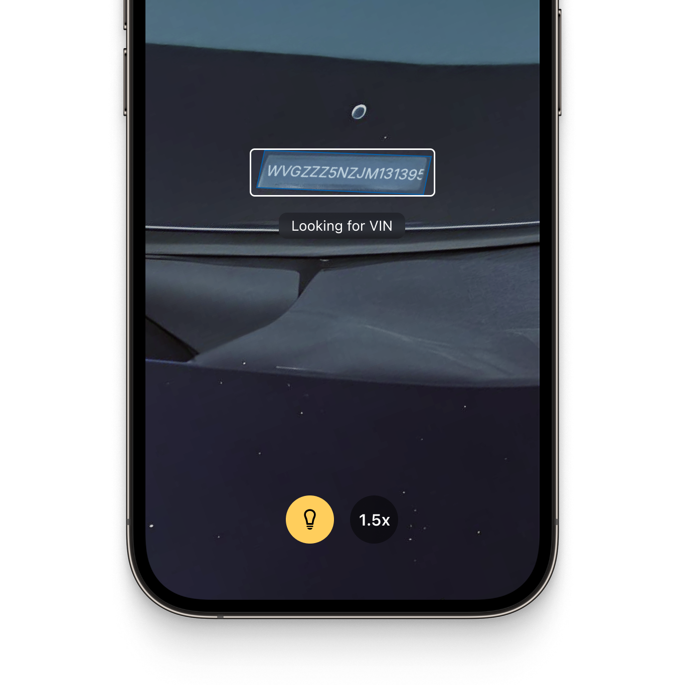
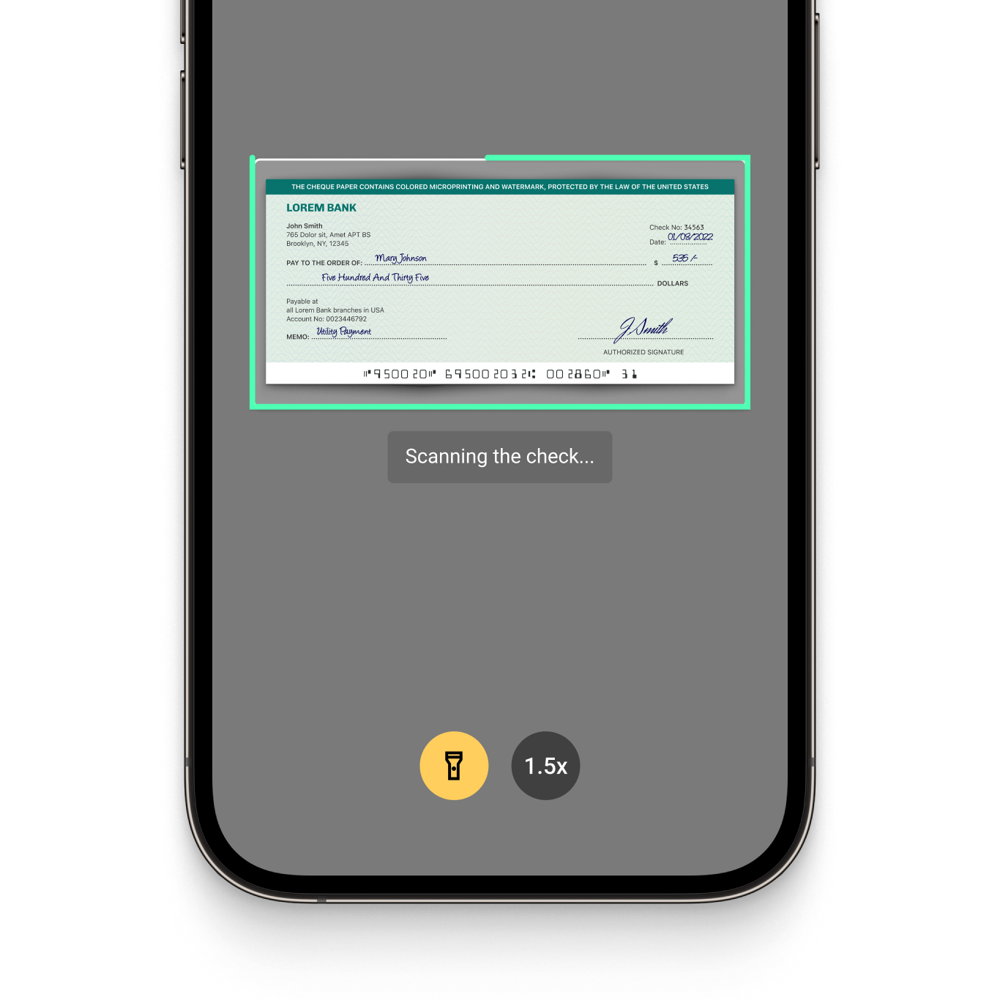

  

  

# Example app for the Scanbot Cordova Ionic Document Scanner SDK and Data Capture Modules

This example app shows how to integrate the [Scanbot Document Scanner SDK](https://scanbot.io/document-scanner-sdk/?utm_source=github.com&utm_medium=referral&utm_campaign=dev_sites) and [Scanbot Data Capture Modules](https://scanbot.io/data-capture-software/?utm_source=github.com&utm_medium=referral&utm_campaign=dev_sites) for Cordova.

## What is the Scanbot SDK?

The Scanbot SDK is a set of high-level APIs that lets you integrate document scanning and data extraction functionalities, into your mobile apps and websites. It runs on all common mobile devices and operates entirely offline. No data is transmitted to our or third-party servers.

With our Ready-To-Use UI (RTU UI) components, you can integrate the Scanbot SDK into your apps in less than an hour. 

💡 For more details about the Scanbot Cordova Document Scanner SDK and Data Capture Modules, please check out our [documentation.](https://docs.scanbot.io/cordova/document-scanner-sdk/introduction/?utm_source=github.com&utm_medium=referral&utm_campaign=dev_sites)

## How to run this example app?

### Requirements

* [NodeJS 16+](https://nodejs.org/) (installation via [nvm](https://github.com/nvm-sh/nvm) recommended)
* [Cordova CLI](https://cordova.apache.org/)
* [Ionic CLI](https://ionicframework.com/)
* [native-run CLI](https://www.npmjs.com/package/native-run)
* [Android Studio](https://developer.android.com/studio) and [Xcode](https://developer.apple.com/xcode/)

### Installation

Install node modules:

`npm install`

Install Cordova platforms and plugins (defined in the config.xml of this app):

`ionic cordova prepare`

Check installed platforms and plugins:

`cordova platform ls`

`cordova plugin ls`

You should see Android and iOS as installed platforms and cordova-plugin-scanbot-sdk as installed plugins.

### Running the app

#### Android:

`ionic cordova run android`

#### iOS:

`ionic cordova prepare ios`

Open the workspace platforms/ios/Scanbot SDK Example Ionic.xcworkspace in Xcode and adjust the "Signing" settings accordingly. Then build and run the app in Xcode.

## Overview of the Scanbot SDK

### Document Scanner SDK

Our Cordova Plugin Document Scanner allows you to turn smartphones into reliable and easy-to-use document scanners. It offers the following features:

* **User guidance**: Ease of use is crucial for large user bases. Our on-screen user guidance helps even non-tech-savvy users create perfect scans.

* **Automatic capture**: The SDK automatically captures the scan when the device is optimally positioned over the document. This reduces the risk of blurry or incomplete document scans compared to manually-triggered capture. If an error occurs during this process, the system will prompt the user to reposition the document until the document has been scanned successfully.

* **Automatic cropping**: Our SDK uses edge detection to automatically identify document borders. Then, it uses auto-cropping to straighten and crop the scanned document, ensuring high-quality scan results.

* **Custom filters:** Every use case has specific image requirements. With the SDK’s custom filters you can turn the captured image into optimal input for your backend system. They include grayscale, several binarization options, and more. All these filters can be automatically applied to all the scanned pages of the file.

* **Document Quality Analyzer:** This feature automatically rates the quality of the pages from “very poor” to “excellent.” If the quality is below a specified threshold, it displays an error message to prompt the user to rescan.

* **Export formats:** The Scanbot Document Scanner SDK supports several output formats (JPG, PDF, TIFF, and PNG). This ensures your downstream solutions receive the best format to store, print, or share the digitized document – or to process it further.

|  |  |  |
| :-- | :-- | :-- |

### Data Capture Modules

The Scanbot SDK Data Capture Modules allow you to extract data from a wide range of structured documents and to integrate OCR text recognition capabilities. They include:

#### [MRZ Scanner](https://scanbot.io/data-capture-software/mrz-scanner/?utm_source=github.com&utm_medium=referral&utm_campaign=dev_sites) 
This module allows quick and accurate data extraction from the machine-readable zones on identity documents. It captures all important MRZ data from IDs and passports and returns it in the form of simple key-value pairs. This is much simpler, faster, and less mistake-prone than manual data entry.

#### [Check Scanner (MICR)](https://scanbot.io/data-capture-software/check-scanner/?utm_source=github.com&utm_medium=referral&utm_campaign=dev_sites)
The MICR Scanner offers reliable data extraction from international paper checks, capturing check numbers, routing numbers, and account numbers from MICR codes. This simplifies workflows and reduces errors that frustrate customers and employees.

#### [Text Pattern Scanner](https://scanbot.io/data-capture-software/data-scanner/?utm_source=github.com&utm_medium=referral&utm_campaign=dev_sites)
Our Text Pattern Scanner allows quick and accurate extraction of single-line data. It captures information based on customizable patterns tailored to your specific use case. This replaces error-prone manual data entry with automatic capture.

#### [VIN Scanner](https://scanbot.io/data-capture-software/vin-scanner/?utm_source=github.com&utm_medium=referral&utm_campaign=dev_sites)
The VIN scanner enables instant capture of vehicle identification numbers (VINs) from trucks or car doors. It uses OCR to convert the image of the VIN code into structured data for backend processing. This module integrates into mobile or web-based fleet management applications, enabling you to replace error-prone manual entry with fast, reliable data extraction.

#### Document Data Extractor
Through this feature, our SDK offers document detection and data capture capabilities for a wider range of documents. It accurately identifies and crops various standardized document types including [German ID cards](https://scanbot.io/data-capture-software/id-scanner/?utm_source=github.com&utm_medium=referral&utm_campaign=dev_sites), passports, [driver's licenses](https://scanbot.io/data-capture-software/german-drivers-license-scanner/?utm_source=github.com&utm_medium=referral&utm_campaign=dev_sites), [residence permits](https://scanbot.io/data-capture-software/residence-permit-scanner/?utm_source=github.com&utm_medium=referral&utm_campaign=dev_sites), and the [EHIC](https://scanbot.io/data-capture-software/ehic-scanner/?utm_source=github.com&utm_medium=referral&utm_campaign=dev_sites). It uses the Scanbot OCR engine for accurate data field recognition, without requiring additional OCR language files.

|  |  |  |
| :-- | :-- | :-- |

## Additional information

### Free integration support

Need help integrating or testing our Cordova Document Scanner SDK? We offer [free developer support](https://docs.scanbot.io/support/?utm_source=github.com&utm_medium=referral&utm_campaign=dev_sites) via Slack, MS Teams, or email.

As a customer, you also get access to a dedicated support Slack or Microsoft Teams channel to talk directly to your Customer Success Manager and our engineers.

### Trial licensing and pricing

The Scanbot SDK examples will run for one minute per session without a license. After that, all functionalities and UI components will stop working. 

To try the Scanbot SDK without the one-minute limit, you can request a free, no-strings-attached [7-day trial license](https://docs.scanbot.io/trial/?utm_source=github.com&utm_medium=referral&utm_campaign=dev_sites).

Alternatively, check out our [demo apps](https://scanbot.io/demo-apps/?utm_source=github.com&utm_medium=referral&utm_campaign=dev_sites) to test the SDK.

Our pricing model is simple: Unlimited document scanning for a flat annual license fee, full support included. There are no tiers, usage charges, or extra fees. [Contact](https://scanbot.io/contact-sales/?utm_source=github.com&utm_medium=referral&utm_campaign=dev_sites) our team to receive your quote.

### Other supported platforms

Besides Cordova & Ionic, the Scanbot SDK is available on:

* [Android](https://github.com/doo/scanbot-sdk-example-android) (native)
* [iOS](https://github.com/doo/scanbot-sdk-example-ios) (native)
* [JavaScript](https://github.com/doo/scanbot-sdk-example-web)
* [Capacitor & Ionic (Angular)](https://github.com/doo/scanbot-sdk-example-capacitor-ionic)
* [Capacitor & Ionic (React)](https://github.com/doo/scanbot-sdk-example-ionic-react)
* [Capacitor & Ionic (Vue.js)](https://github.com/doo/scanbot-sdk-example-ionic-vuejs)
* [Flutter](https://github.com/doo/scanbot-sdk-example-flutter)
* [.NET MAUI](https://github.com/doo/scanbot-sdk-maui-example)
* [React Native](https://github.com/doo/scanbot-sdk-example-react-native)
* [Xamarin](https://github.com/doo/scanbot-sdk-example-xamarin) & [Xamarin.Forms](https://github.com/doo/scanbot-sdk-example-xamarin-forms)

Our Barcode Scanner SDK additionally also supports [Compose Multiplatform / KMP](https://github.com/doo/scanbot-barcode-scanner-sdk-example-kmp), [UWP](https://github.com/doo/scanbot-barcode-scanner-sdk-example-windows) (Windows), and [Linux](https://github.com/doo/scanbot-sdk-example-linux).
